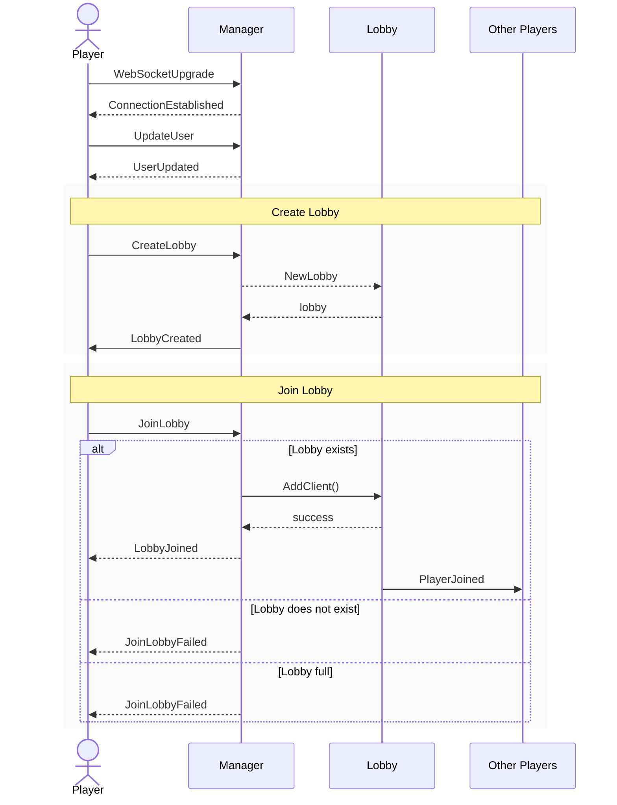

# Durak Multiplayer

This is an online multiplayer port of the game [Durak](https://en.wikipedia.org/wiki/Durak).

Built on Golang using Gorilla Websockets to communicate between the server and the frontend.

